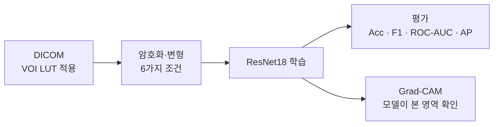

# RSNA — 암호화된 흉부 X-ray로 폐렴 분류가 가능한가? (프라이버시 보존 실험)

> 의료 영상을 원본 그대로 학습에 쓰면 개인정보 노출 위험이 있습니다. 이 실험은 **이미지를 암호화·변형한 상태로 CNN을 학습시켰을 때 폐렴 분류 성능이 얼마나 유지되는지**를, 6가지 변형 조건에서 같은 모델과 같은 데이터 분할로 비교합니다.


| 항목 | 내용 |
|---|---|
| 기간 | 2025.09 |
| 유형 | 개인 연구 실험 |
| 데이터 | RSNA Pneumonia Detection Challenge (Kaggle), 흉부 X-ray DICOM · 정상/폐렴 이진 분류 |
| 내 역할 | 실험 설계, 암호화 기법 구현, 학습·평가·시각화 파이프라인 전체 |

---

## 실험 설계

| 조건 | 변형 방식 |
|---|---|
| `basic` | 원본 (기준선) |
| `chaotic-only` | Logistic map 카오스 수열과 XOR 연산 (키에서 SHA-256으로 seed 생성) |
| `pixelShuffle-only` | 이미지마다 픽셀 위치를 무작위로 재배열 |
| `partShuffle-only` | 8×8 블록 단위로 위치를 무작위로 재배열 |
| `chaotic_pixelShuffle` | XOR 후 픽셀 셔플 |
| `chaotic_partShuffle` | XOR 후 블록 셔플 |

**공통 조건**: ResNet18 (ImageNet 사전학습) · 224×224 · batch 32 · Adam(lr 1e-4) · 최대 30 epochs · 검증 손실 기준 early stopping · 환자 ID 기준 8:2 분할 (`random_state=42`)



---

## 결과

검증셋 5,337장 기준이며, 이 중 폐렴 양성은 23.2%입니다.

| 조건 | Accuracy | Precision | Recall | F1 | ROC-AUC | AP |
|---|---|---|---|---|---|---|
| basic (원본) | 0.865 | 0.828 | 0.528 | 0.645 | **0.918** | **0.794** |
| chaotic-only | 0.830 | 0.711 | 0.448 | 0.550 | **0.861** | **0.658** |
| partShuffle-only | 0.763 | 0.366 | 0.030 | 0.055 | 0.683 | 0.366 |
| pixelShuffle-only | 0.768 | 0.000 | 0.000 | 0.000 | 0.583 | 0.298 |
| chaotic_pixelShuffle | 0.768 | 0.400 | 0.005 | 0.010 | 0.563 | 0.288 |
| chaotic_partShuffle | 0.768 | 0.000 | 0.000 | 0.000 | 0.565 | 0.283 |

<!-- 그래프 자리: _reports/roc_curves.png, _reports/pr_curves.png, _reports/summary_bars.png -->

### 해석
- **XOR 단독은 분류 성능을 상당 부분 유지했습니다** (ROC-AUC 0.918 → 0.861). 모든 이미지에 같은 키를 쓰기 때문에, 같은 픽셀 위치에는 항상 같은 변환이 적용되어 공간 구조가 보존된 것으로 보입니다.
- **셔플이 들어간 조건은 거의 학습되지 않았습니다** (ROC-AUC 0.56~0.68). 이미지마다 배치를 다르게 섞으면서 CNN이 의존하는 공간 정보가 사라졌기 때문입니다.
- **Accuracy만 보면 잘못 판단하게 됩니다.** 셔플 조건의 정확도 0.768은 모든 샘플을 "정상"으로 예측했을 때의 값(음성 비율 76.8%)과 같습니다. 그래서 클래스 불균형에 영향을 받지 않는 ROC-AUC와 AP를 주요 지표로 삼았습니다.

### 한계
- 별도 테스트셋 없이 **검증셋으로 모델 선택과 평가를 함께** 했습니다. 따라서 수치가 다소 낙관적일 수 있습니다.
- 클래스 가중치나 임계값 조정을 하지 않아서, 원본 모델도 recall이 0.53으로 낮습니다.
- XOR에 고정 키를 사용했기 때문에, 이 실험은 **보안 강도가 아니라 "학습 가능성"을 비교**한 것입니다.

---

## 실행 방법

```bash
git clone https://github.com/alberione1110/RSNA.git
cd RSNA
pip install -r requirements_rsna_privacy.txt
```

1. Kaggle에서 [RSNA Pneumonia Detection Challenge](https://www.kaggle.com/c/rsna-pneumonia-detection-challenge) 데이터를 받아 `rsna-pneumonia-detection-challenge/` 폴더에 둡니다. (`stage_2_train_images/`, `stage_2_train_labels.csv`)
2. 실행합니다.

```bash
python run_all.py          # 6개 조건 학습
python run_eval_all.py     # 평가 → 각 폴더 eval_result.json, _reports/summary_metrics.csv
python run_gradcam_all.py  # Grad-CAM 시각화
python plot_comparison.py  # ROC / PR / 비교 그래프
```

- GPU 환경을 권장합니다. 학습된 가중치(`.pth`)는 저장소에 포함하지 않습니다.

---

## 폴더 구조

```text
RSNA/
├─ _shared/                 # 공통 모듈
│  ├─ encrypt_ops.py        # Chaotic XOR, 픽셀/블록 셔플
│  ├─ dicom_utils.py        # DICOM → 이미지 (VOI LUT)
│  ├─ dataset.py            # RSNADataset
│  ├─ train_util.py         # ResNet18, 학습 루프, early stopping
│  ├─ eval.py               # 지표 계산
│  └─ gradcam.py
├─ basic/ chaotic-only/ ... # 조건별 train.py · evaluate.py · eval_result.json
├─ _reports/                # 지표 요약 CSV, 그래프
├─ run_all.py · run_eval_all.py · run_gradcam_all.py
└─ plot_comparison.py · plot_from_eval_json.py
```
